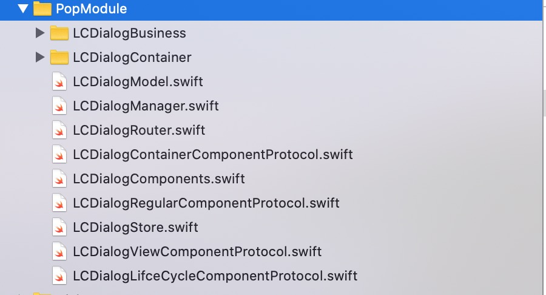
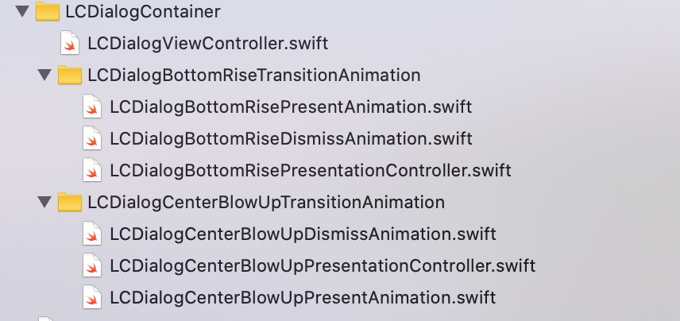
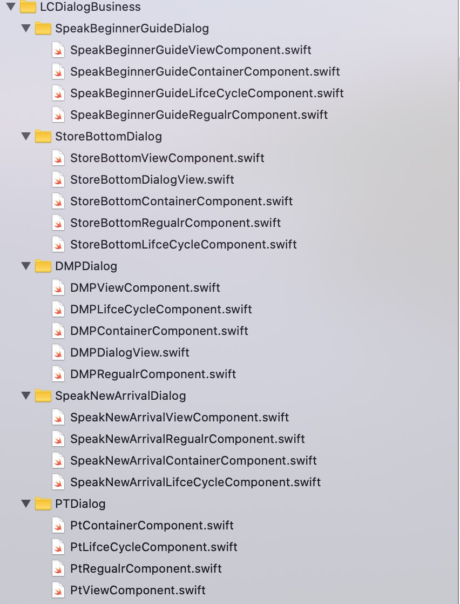

## 弹窗重构前现状分析 

- 弹窗容器不一致 

              1. 新手引导 是直接覆盖在window上 
              2. 口语上新 是直接覆盖在tableView上 
              3. PT弹窗 是AlertController 


- 弹窗代码导致业务控制器代码臃肿 

1. 尤其是首页，弹窗特别多，弹窗代码特别多【视图加载代码、打点代码、弹窗Action代码】 


- 弹窗之前没有一套优先级管理规则，导致判断条件相互依赖耦合，久而久之难以维护 

  

- 每次都要关系弹窗页面点的问题，弹窗弹出页面点记一次，弹窗消失页面点要重置上一个页面，非常容易漏掉，从而导致页面点错乱【这是由于iOS 机制 viewDidAppear 以及 打点库 页面点 绑定太死决定 】 

  

- 开发者写弹窗没有一套统一的范式【这是最重要的一点，弹窗之前大家都是各写各的，风格迥异;统一范式的好处在于，降低沟通成本，形成统一 的维护习惯，利于维护】 


## 针对弹窗现状要做的事情 

1. 建立一套统一的弹窗容器(模态视图+自定义转场动画)  
2. 需要将弹窗业务代码从 业务页面剥离 并分散管理，给 业务页面 瘦身 
3. 需要有一个弹窗管理器，每个弹窗都会去管理器注册，由弹窗管理器决定弹窗弹出优先级 
4. 弹窗页面点由开发者声明，由管理器统一调用，页面点重置也由弹窗管理器管理 
5. 弹窗没有一套统一编码范式，从 接口设计 和 数据协议抽象 上两点进行了约束


## 弹窗设计思路 

1. 弹窗进行了职责的划分，拆分出了4个组件【一个弹窗由4个组件构成，4个组件构成一个弹窗】 
2. 每个组件抽象出一套数据协议Protocol  
3. 弹窗管理器的职责 ：
   - binder: 将弹窗的4个组件进行关系绑定、数据获取、行为通知 
   - 弹窗队列管理 


设计模式： 组合模式 + Protocol 的方式完成了这套实现 


## 弹窗重构之后的目录结构 










| 文件名                             | 作用                     |
| ---------------------------------- | ------------------------ |
| LCDialogManager                    | 弹窗管理器               |
| LCDialogRegularComponentProtocol   | 弹窗视图组件抽象协议     |
| LCDialogViewComponentProtocol      | 弹窗视图组件抽象协议     |
| LCDialogContainerComponentProtocol | 弹窗容器组件抽象协议     |
| LCDialogLifeCycleComponentProtocol | 弹窗容器生命周期抽象协议 |
| LCDialogContainer 目录             | 弹窗容器控件             |
| LCDialogBusiness 目录              | 具体弹窗的业务代码       |


1. 一一剖析一下每个组件抽象协议的Protocol的作用  
2. 再讲解一下抽象协议的高扩展性，最开始 只有2个组件，到后来扩展到的4个组件的;每个组件协议最开始很少，随着需求的添加，逐渐变多 


## 如何新增一个弹窗 

以PT弹窗为例 ：

```swift
struct PtViewComponent: LCDialogViewComponentProtocol {
  
  enum Page: String {
    case home
    case learn
    case premium
    case me
  }
  
  var id: LCDialogModel.DialogId {
    return .PtTestDialog
  }
  
  var type: LCDialogModel.DialogType {
    return .UN_ALL_PAGE_FUNCTION
  }
  
  func loadPopView() -> UIView {
    let ptView = PTTestTipsView()
    ptView.closeBlock = {
      AnalyticsAction.pt.pt_popup.cancel.actionTrack()
      /// 此时页面点依旧是pt弹窗页面点
      
      LCDialogManager.sharedManager.dismissTopLevelDialog(animated: true, needResetPageTracker: true)
      /// needResetPageTracker = true 之后 ，
      /// 非叠层：5个主页的某个页面的页面点 打点
      /// 叠层: 在PT弹窗下层，弹窗的页面点 打点
    }

    ptView.startBlock = {
      AnalyticsAction.pt.pt_popup.click_pt.actionTrack()
      /// 此时页面点依旧是pt弹窗页面点
      
      LCDialogManager.sharedManager.currentNav?.pushViewController(PTEntranceController(enterFrom: .pt_popup), animated: true)
      /// 此时推出PTEntranceController ， 会变成PT落地页的页面点；
      /// 如果用户从PT落地页返回，非叠层：5个主页的某个页面的页面点 打点
      /// 如果用户从PT落地页返回，叠层：顶层弹窗页面点打点
      
      LCDialogManager.sharedManager.dismissTopLevelDialog(animated: false, needResetPageTracker: false)
      /// needResetPageTracker = false 之后 ，这里必须false
      /// 非叠层：5个主页的某个页面的页面点 不打点，避免覆盖 PT落地页的页面点 ，造成打点错乱
      /// 叠层: 在PT弹窗下层，弹窗的页面点 不打点，避免覆盖 PT落地页的页面点 ，造成打点错乱
    }
    return ptView
  }
  
  func layout(popView: UIView) {
    popView.snp.makeConstraints({ (make) in
      make.size.equalTo(CGSize(width: 295, height: 378))
      make.center.equalToSuperview()
    })
  }
  
  func pageTrack(fromPage: LCDialogModel.DialogPage) {
    let page: Page
    switch fromPage {
    case .HOME_LINGO_VIDEO:
      page = .home
    case .HOME_LINGO_SPEAK:
      page = .home
    case .LEARN:
      page = .learn
    case .PREMIUM:
      page = .premium
    case .ME:
      page = .me
    case .UNKNOWN_PAGE:
      page = .home
    }
    AnalyticsPage.pt.pt_popup(page: page.rawValue).pageTrack()
  }
  
  func clickMaskAreaDismiss() {
    AnalyticsAction.pt.pt_popup.cancel.actionTrack()
  }
  
}
```


```swift
struct PtRegualrComponent: LCDialogRegularComponentProtocol {
  var canShow: Bool {
    guard !App.isPremium else { return false }
    guard UserDefaults.standard.bool(forKey: UserDefaultsKeys.hasShowPTTips.rawValue) == false else { return false }
    
    guard let registerTime = App.user?.registerAtSec else { return false }
    
    let register = TimeInterval(registerTime) ?? 0
    let current = Date().timeIntervalSince1970
    let overTwoDay = (current - register) > (2 * 24 * 60 * 60)
    if !overTwoDay {
      // 注册不到2天
      return false
    } else {
      // 注册超过2天
      return true
    }
  }
  
  var priority: Int {
    return 21001
  }
  
  var pages: [LCDialogModel.DialogPage] {
    if let currentIdentity = ABTestManager.currentIdentity,
      currentIdentity == .B {
      return [.PREMIUM,
              .ME]
    }
    return [.HOME_LINGO_VIDEO,
            .HOME_LINGO_SPEAK,
            .LEARN,
            .ME]
  }
  
  var canNestPop: Bool {
    return false
  }
  
  var canCover: Bool {
    return false
  }
  
  func didShowDialog() {
    UserDefaults.standard.set(true, forKey: UserDefaultsKeys.hasShowPTTips.rawValue)
  }
  
}
```


```swift
struct PtContainerComponent: LCDialogContainerComponentProtocol {
  
}
```


```swift
struct PtLifceCycleComponent: LCDialogLifceCycleComponentProtocol {
  
}
```


```swift
/// PT
  override func viewDidLoad() {
    super.viewDidLoad()
    LCDialogManager.sharedManager.addDialog(components:
    LCDialogComponents(regularComponent: PtRegualrComponent(),
                           viewComponent: PtViewComponent(),
                           containerComponent: PtContainerComponent(),
                           lifeCycleComponent: PtLifeCycleComponent()))
    LCDialogManager.sharedManager.showDialog()
}
```


## 弹窗模块改进 

1. 文件生成比较麻烦，我们可以自定义Xcode模板文件的，快速生成组件文件和模板代码  
2. 弹窗容错机制，比如弹窗在某些极端情况下 弹窗管理器出现报错，管理队列出现混乱，需要有一种容错处理机制，监控并上报log，并恢复UI界面正常以及管理器队列管理重置